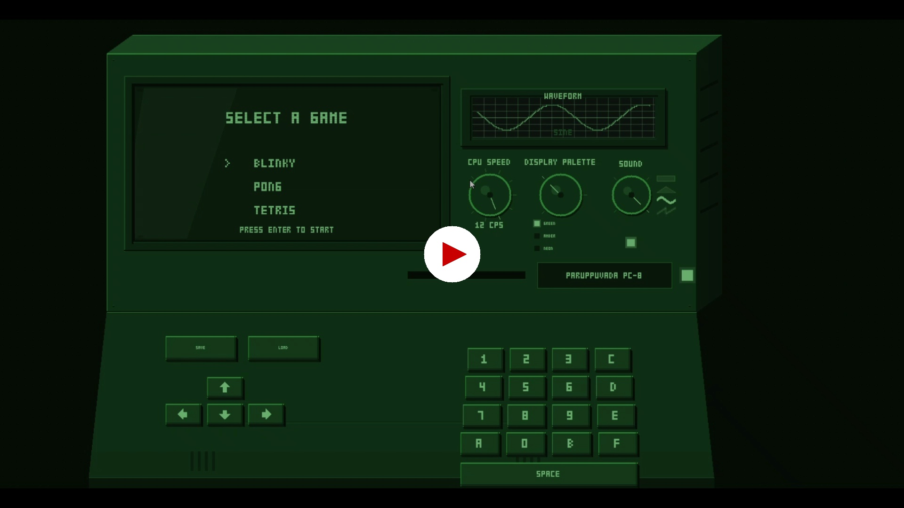

# Paruppuvada PC-8 — CHIP-8 Emulator

A C++/SDL2 CHIP-8 emulator presented as a retro-computer experience. The project contains the CHIP-8 virtual machine, SDL2 graphics/audio, ROMs, save-state support, and a custom `RetroComputerUI` that presents the emulator through a physical-looking 3D pixel-art computer interface.

## Demo
[](https://raw.githubusercontent.com/amalkphilip/Paruppuvada/main/demo.mp4)

## Overview

CHIP-8 is a small virtual machine originally designed for simple games on early microcomputers. This project implements the CHIP-8 architecture and provides a desktop emulator for running `.ch8` ROMs.

The project also contains a custom retro-computer presentation layer built with SDL2 2D rendering. The emulator content can be rendered into a recessed CRT-style display while the surrounding machine supplies the physical keyboard/control-panel appearance.

## Core CHIP-8 System

The emulator is built around the following CHIP-8 components:
- **Memory:** 4 KB (4096 bytes)
- **Program start:** 0x200
- **Registers:** 16 general-purpose 8-bit registers (V0–VF)
- **Index register:** 16-bit I
- **Program counter:** 16-bit PC
- **Stack:** 16 levels with stack pointer (SP)
- **Display:** 64 × 32 monochrome pixels
- **Timers:** delay timer and sound timer, updated at 60 Hz
- **Keypad:** 16-key hexadecimal keypad
- **Instruction set:** all 35 standard CHIP-8 instructions are implemented in the current project sources

## Features

### CHIP-8 Emulation
- CHIP-8 opcode execution
- Memory and register management
- Stack and subroutine handling
- 64 × 32 monochrome display with simulated CRT glowing pixels
- Keyboard input
- Delay and sound timers
- SDL2-based audio generation with selectable waveforms (Sine, Square, Triangle, Sawtooth)
- SDL2-based rendering

### ROMs Included
The repository currently includes example ROMs:
```
roms/
├── Blinky.ch8
├── Pong.ch8
└── Tetris.ch8
```

### Save States
The project contains emulator save/load support and per-ROM save files under:
```
saves/
├── Blinky.ch8.sav
├── Pong.ch8.sav
└── Tetris.ch8.sav
```
The emulator state serialization code stores/restores the complete emulator state, including the 4 KB memory, registers, index register, program counter, stack, stack pointer, timers, and display state.

### RetroComputerUI Integration
The project includes a fully integrated custom `RetroComputerUI` implemented in C++/SDL2, presented as a beautiful horizontal (1280x800) desktop machine. Its purpose is to present the emulator inside a retro-computer shell rather than as a plain window.

The UI implementation includes:
- 2.5D / pixel-art retro-computer rendering (Green by default)
- Layered case faces and depth with a fully horizontal design layout
- Dedicated Knobs for CPU Speed, Display Palette, and Audio Visualization
- Selectable computer case themes: WHITE, GREEN, AMBER, CHARCOAL
- Recessed CRT bezel and glass
- Bright glowing pixel rendering and thick, bold virtual text
- Virtual CHIP-8 keypad and direction arrows

## Keyboard Mapping

The standard CHIP-8 keypad is mapped to a QWERTY keyboard in the following layout:

```
CHIP-8:             QWERTY:
┌─┬─┬─┬─┐           ┌─┬─┬─┬─┐
│1│2│3│C│           │1│2│3│4│
├─┼─┼─┼─┤           ├─┼─┼─┼─┤
│4│5│6│D│     =     │Q│W│E│R│
├─┼─┼─┼─┤           ├─┼─┼─┼─┤
│7│8│9│E│           │A│S│D│F│
├─┼─┼─┼─┤           ├─┼─┼─┼─┤
│A│0│B│F│           │Z│X│C│V│
└─┴─┴─┴─┘           └─┴─┴─┴─┘
```

Additional virtual controls can be mapped to games:
- UP → CHIP-8 key 2
- DOWN → CHIP-8 key 8
- LEFT → CHIP-8 key 4
- RIGHT → CHIP-8 key 6
- SPACE → CHIP-8 key 5

## Emulator Controls

- `ESC` → exit / pause depending on the active control flow
- `F5` / SAVE UI Button → quick save
- `F9` / LOAD UI Button → open load menu
- `+` / UI Speed Knob → increase emulation speed
- `-` / UI Speed Knob → decrease emulation speed
- UI Color Selector → change computer exterior theme

### Game-Specific Controls Currently Documented by the Project

**PONG**
- Left paddle: `1` = up, `Q` = down
- Right paddle: `4` = up, `R` = down (also via ARROWS)

**TETRIS**
- `Q` / `UP` = rotate
- `W` / `DOWN` / `SPACE` = drop
- `E` / `RIGHT` = move right
- `A` / `LEFT` = move left

**BLINKY (PAC-MAN)**
- `ARROWS` = move
- `SPACE` = start / pause

## Project Structure

```text
Paruppuvada/
│
├── CHIP-8/
│   ├── src/
│   │   ├── chip8.cpp
│   │   ├── chip8.h
│   │   ├── main.cpp
│   │   ├── retro_computer_ui.cpp
│   │   ├── retro_computer_ui.h
│   │   ├── retro_theme.cpp
│   │   ├── retro_theme.h
│   │   ├── virtual_key.cpp
│   │   ├── virtual_key.h
│   │   ├── waveform.cpp
│   │   └── waveform.h
│   │
│   ├── roms/
│   ├── saves/
│   ├── Makefile
│   ├── README.md
│   ├── chip8.exe
│   └── SDL2.dll
│
└── .vscode/
```

## Building on Windows with MSYS2

The provided Makefile targets GCC/MinGW and links SDL2.

**1. Install MSYS2**
Install MSYS2 from:
https://www.msys2.org/
Use the **MSYS2 UCRT64** terminal.

**2. Install Dependencies**
```bash
pacman -S --noconfirm mingw-w64-ucrt-x86_64-gcc mingw-w64-ucrt-x86_64-make mingw-w64-ucrt-x86_64-SDL2
```

**3. Build**
From the CHIP-8 directory:
```bash
mingw32-make
```

**4. Run a ROM**
```bash
./chip8 roms/Tetris.ch8
```
Other included ROMs:
```bash
./chip8 roms/Pong.ch8
./chip8 roms/Blinky.ch8
```

## Technology Stack
- C++17
- SDL2
- GCC / MinGW
- Make / MinGW Make
- CHIP-8 virtual machine architecture
- SDL2 audio
- SDL2 2D pixel-art rendering

## License
The repository contains a `LICENSE` file under `CHIP-8/`. Refer to that file for the project's license terms.
